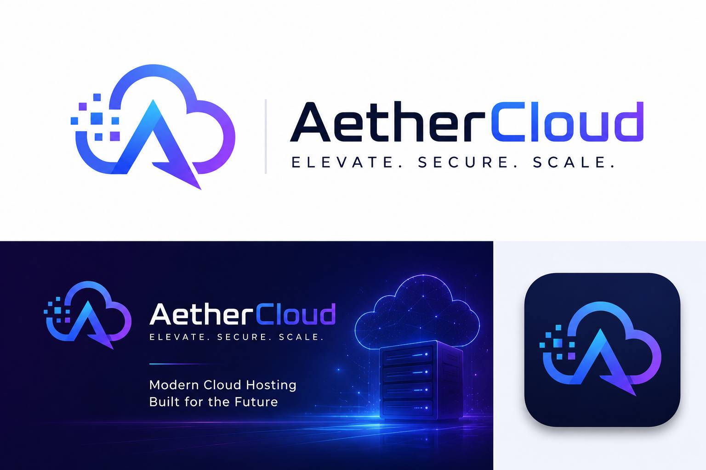

# ☁️ AetherCloud – Modern Cloud Hosting, Simplified

<table>
  <tr>
    <td width="40%">
      
    </td>
    <td width="60%">
      Welcome to <strong>AetherCloud</strong> — a sleek, fully responsive cloud hosting landing page thoughtfully crafted using <strong>HTML5</strong> and <strong>CSS3</strong>. This project demonstrates my front-end development expertise by delivering a visually appealing, user-friendly experience that showcases modern SaaS-style design principles and cloud infrastructure presentation.
    </td>
  </tr>
</table>

---

## 🔍 Features

- 🎨 **Modern SaaS UI Design** — Clean, professional cloud hosting landing page layout.
- 📱 **Fully Responsive Layout** — Optimized for desktops, tablets, and smartphones.
- ⚡ **Lightweight & Fast** — Built without frameworks for maximum performance.
- 🧠 **User-Focused Experience** — Structured layout with intuitive navigation flow.
- ☁️ **Cloud Hosting Theme** — Designed to simulate a real-world cloud service platform UI.
- 🧾 **Clean Section Structure** — Organized sections for hero, features, pricing, and footer.
- 🎯 **Minimal & Scalable Design** — Easy to extend into a full SaaS product.

---

## 📄 Project Structure

- **index.html** — Main landing page introducing _AetherCloud_ and showcasing cloud hosting services.
- **style.css** — Core stylesheet for layout, colors, typography, and responsiveness.
- **README.md** — Detailed documentation of the AetherCloud project.
- **images/** — Contains project assets including logos, icons, backgrounds, and UI visuals used throughout the site.

---

## 🌐 Live Demo

👉 [Visit AetherCloud Website]([https://chalitha-wickramasinghe.github.io/empower-young-minds-learnova/](https://chalitha-wickramasingha.github.io/AetherCloud/)

> Hosted with GitHub Pages — lightweight, responsive, and production-style UI simulation.

---

## 📸 Screenshots

> _Add your screenshots here once available_

- 

---

## 🛠️ Technologies Used

- **HTML5** – Semantic markup for structured, accessible content.
- **CSS3** – Responsive styling with Flexbox, media queries, and modern UI design techniques.
- **Git & GitHub** – Version control and project hosting.

---

## ⚙️ How to Run

### 🖥️ Run Locally:

1. Clone or download the repository.
2. Open `index.html` with any modern web browser.
3. No additional setup or dependencies required.

---

## 👨‍💻 Author

**Chalitha Wickramasingha**

🔗 [GitHub](https://github.com/chalitha-wickramasingha)  
🔗 [LinkedIn](https://www.linkedin.com/in/chalitha-t-wickramasingha)

---

## 📄 License

This project is open-source and available under the MIT License.

---

> ☁️ _Build modern. Scale simple. Think cloud-first._  
> Thank you for visiting AetherCloud!
